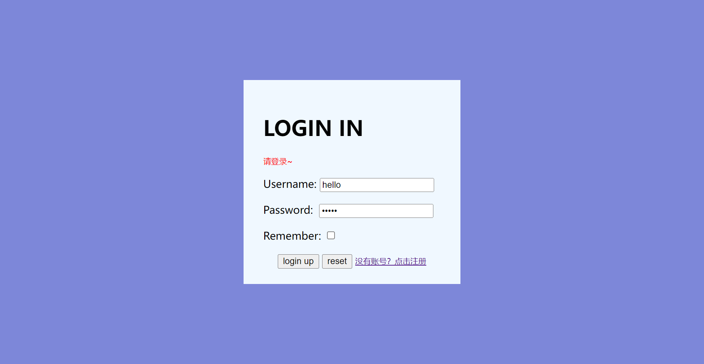
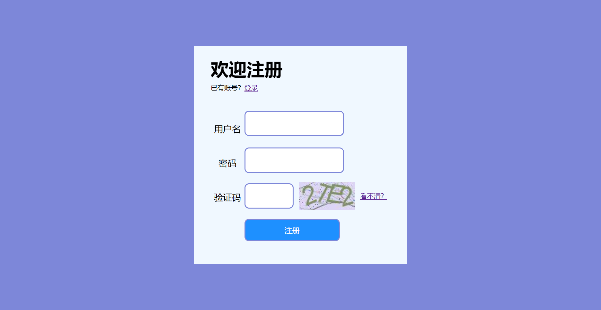
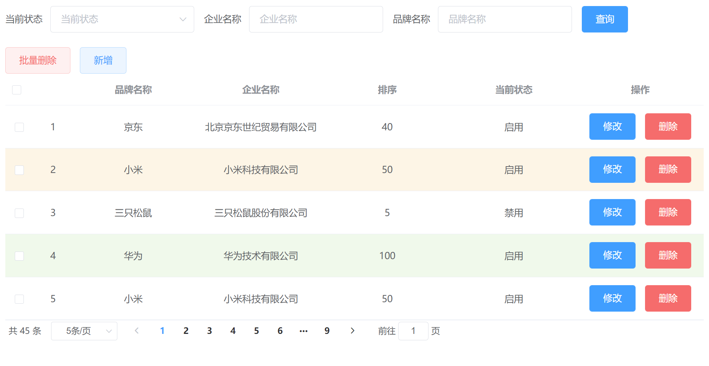
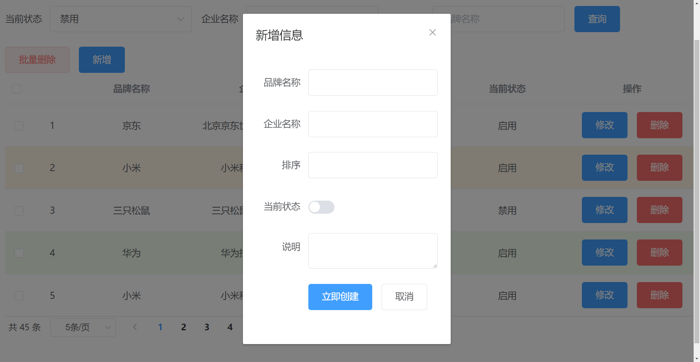
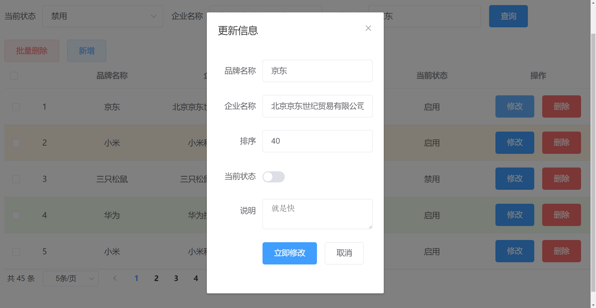
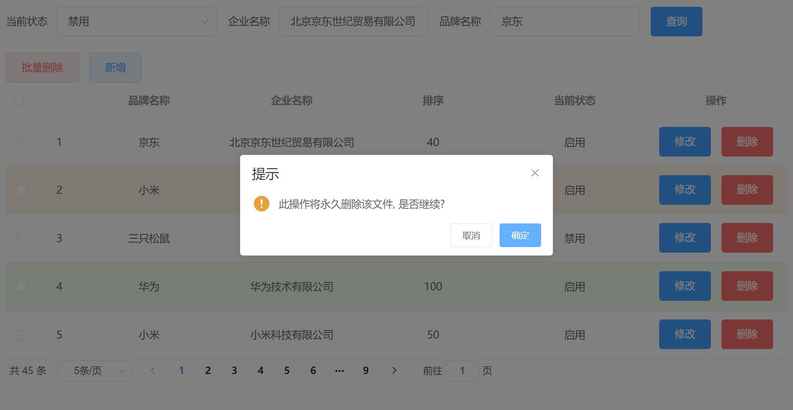

# 信息查询系统

#### 介绍

一个小型web开发案例，实现了登录注册、信息的增删改查功能。

用户的登录界面使用了`jsp`编写。
信息展示界面实现了前后端分离，使用了`vue`、`element`和`axios`。

前端技术应用`html`、`CSS`、`JS`。

后端涉及了`Mybatis`作为持久层框架，MySQL作为底层数据库管理系统。

---

#### 效果图

